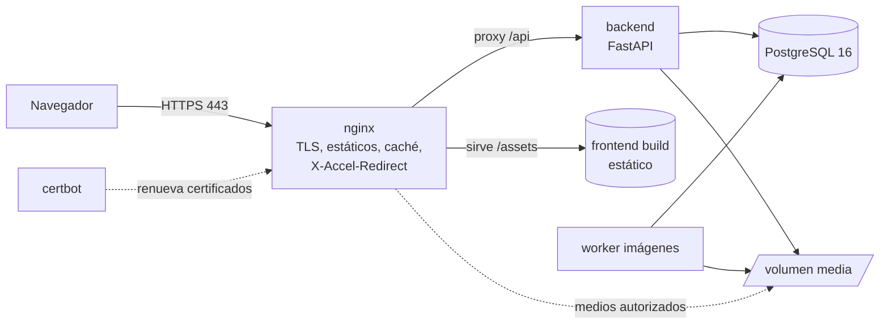

# Bitácora — Blog de Viajes Personal

**Documento de Especificación de Producto y Sistema**
Versión 1.1 · 13 de julio de 2026 · Metodología: **Spec Driven Development (SDD) basado en releases**

---

## Changelog

| Versión | Fecha | Cambios |
|---|---|---|
| 1.0 | 2026-07-13 | Versión inicial. |
| 1.1 | 2026-07-13 | Mejoras: (1) nuevo **RF-R1-20** — cambio de contraseña del propio usuario y flujo forzado tras reset; (2) nuevo **RNF-R1-08** — higiene de logs y retención de registros; (3) aclarada la expiración de sesión en **RF-R1-02** (deslizante + tope absoluto); (4) modelo de datos: `UNIQUE(trip_id, content_hash)` explícito y `last_seen_at` en `sessions`; (5) §3.3: prefijo `[SDD]` para commits que solo tocan artefactos de especificación (resuelve el arranque, cuando aún no existen tareas); (6) §8: limpieza periódica de sesiones expiradas e intentos de login antiguos. |

---

## 1. Visión

Bitácora es un blog de viajes personal, autoalojado y privado por defecto, pensado para una sola persona (o un grupo muy reducido) que quiere documentar sus viajes con textos ricos y muchas fotografías, con una experiencia de lectura moderna, rápida y bonita en cualquier dispositivo.

El producto tiene dos caras:

1. **Cara pública (sin autenticar):** la página de acceso, que además de ser el login es un escaparate visual — un collage vivo de fotografías marcadas como públicas.
2. **Cara privada (autenticada):** la lectura completa de los relatos de viaje con todas las fotos (públicas y privadas), y un panel de administración donde se crean los viajes, se escribe con un editor rico y se suben las fotos organizadas por temas.

Principios de diseño del producto:

- **Privado por defecto, público por elección.** Nada se expone si no se marca explícitamente como público.
- **Las fotos son protagonistas.** Pipeline de imágenes de primera clase: compresión inteligente, variantes por tamaño, visor a pantalla grande.
- **Sencillez operativa.** Un `docker compose up -d` debe levantar todo el sistema. La recuperación de acceso nunca depende de un tercero: siempre hay una puerta de servicio desde la terminal del servidor.
- **Calidad verificable.** Cada requisito es trazable hasta el código y sus tests, y viceversa.

## 2. Alcance

### 2.1 Dentro del alcance

- Autenticación con usuario y contraseña, bloqueo temporal por intentos fallidos y recuperación de acceso vía CLI en el servidor.
- Portada/login con collage de fotos públicas.
- Vista de lector autenticado: listado, lectura y búsqueda de viajes con todas sus fotos.
- Panel de administración: CRUD de viajes, temas y fotos; editor de texto rico con imágenes incrustadas a cualquier tamaño.
- Pipeline de imágenes: compresión optimizada, variantes responsive, visor lightbox a tamaño grande en ventana separada.
- Organización de fotos por temas del blog con estructura de carpetas legible y práctica.
- Búsqueda de artículos por texto completo, tema y fecha.
- Despliegue con Docker Compose: nginx (TLS), backend, PostgreSQL.
- Cobertura de tests ≥ 80 % (unitarios + end-to-end) y desarrollo con código seguro (OWASP).

### 2.2 Fuera del alcance (v1)

- Comentarios de visitantes, redes sociales, suscripciones o newsletters.
- Multiidioma de la interfaz (la UI se entrega en español).
- Vídeo (solo imágenes; puede planificarse como release futura R4).
- Federación, API pública o app móvil nativa (la web es responsive y instalable como PWA).
- Registro de usuarios en abierto: los usuarios los crea el administrador o la CLI.

## 3. Metodología: Spec Driven Development basado en releases

### 3.1 Artefactos y estructura del repositorio

El desarrollo se dirige por especificaciones versionadas. El repositorio separa claramente los cuatro niveles — especificación, planificación, tarea e implementación — y los enlaza mediante identificadores estables:

```
bitacora/
├── specs/                      # QUÉ se construye
│   ├── SPEC-MASTER.md          # Este documento (visión y sistema completos)
│   ├── SPEC-R1.md              # Especificación de la release 1 (RF-R1-xx, RNF-R1-xx)
│   ├── SPEC-R2.md
│   ├── SPEC-R3.md
│   └── adr/                    # Architecture Decision Records (ADR-001, ADR-002…)
├── plan/                       # CÓMO y CUÁNDO
│   ├── PLAN-R1.md              # Paquetes de trabajo WP-R1-x → mapean RF/RNF
│   ├── PLAN-R2.md
│   └── PLAN-R3.md
├── tasks/                      # Trabajo ejecutable
│   ├── R1/TASK-R1-001.md       # Cada tarea referencia su WP y sus RF/RNF
│   ├── R1/TASK-R1-002.md
│   └── …
├── tools/
│   ├── traceability.py         # Genera la matriz de trazabilidad y la valida en CI
│   └── hooks/commit-msg        # Rechaza commits sin ID de tarea válido
├── backend/                    # Implementación (FastAPI)
├── frontend/                   # Implementación (React + Vite + TypeScript)
├── deploy/                     # docker-compose, nginx, certbot, scripts
├── tests/e2e/                  # Playwright
└── docs/
    └── TRACEABILITY.md         # Matriz generada automáticamente (no editar a mano)
```

### 3.2 Esquema de identificadores

| Nivel | Formato de ID | Ejemplo | Vive en |
|---|---|---|---|
| Requisito funcional | `RF-<release>-<nn>` | `RF-R1-03` | `specs/SPEC-R1.md` |
| Requisito no funcional | `RNF-<release>-<nn>` | `RNF-R1-02` | `specs/SPEC-R1.md` |
| Paquete de trabajo | `WP-<release>-<n>` | `WP-R1-2` | `plan/PLAN-R1.md` |
| Tarea | `TASK-<release>-<nnn>` | `TASK-R1-014` | `tasks/R1/` |
| Decisión de arquitectura | `ADR-<nnn>` | `ADR-004` | `specs/adr/` |

### 3.3 Trazabilidad bidireccional (obligatoria)

La trazabilidad debe poder recorrerse en ambos sentidos: desde un requisito hasta las líneas de código y tests que lo implementan, y desde cualquier commit o test hasta el requisito que justifica su existencia.

**Hacia adelante (spec → código):**

1. Cada `RF`/`RNF` lista en su ficha los `WP` que lo desarrollan.
2. Cada `WP` lista sus `TASK`.
3. Cada `TASK` termina en uno o más commits/PR.

**Hacia atrás (código → spec), mediante convenciones verificables:**

- **Commits:** todo commit lleva el ID de tarea como prefijo: `[TASK-R1-014] Bloqueo temporal tras 5 fallos de login`. Un hook de `commit-msg` rechaza commits sin ID válido. Excepción: los commits que **solo** tocan artefactos de especificación (`specs/`, `plan/`, `tasks/`, `docs/`, `tools/`) pueden usar el prefijo `[SDD]`; los commits `Merge`/`Revert` generados por git también se aceptan.
- **Código:** los módulos/funciones que materializan un requisito lo declaran en su docstring: `"""Implementa: RF-R1-03, RNF-R1-02."""`
- **Tests backend:** marker de pytest `@pytest.mark.spec("RF-R1-03")`.
- **Tests e2e:** anotación en Playwright `test.info().annotations.push({ type: "spec", description: "RF-R1-03" })`.

**Verificación automática:** `tools/traceability.py` se ejecuta en CI y:

- Genera `docs/TRACEABILITY.md` con la matriz completa RF/RNF ↔ WP ↔ TASK ↔ commits ↔ tests.
- **Falla el pipeline** si algún RF/RNF de la release en curso no tiene al menos un test asociado, o si existe una TASK cerrada sin commits, o commits sin TASK.

### 3.4 Ciclo de vida de una release

1. **Especificar:** se redacta/actualiza `SPEC-Rn.md`; los requisitos se congelan (cambios posteriores = nueva versión de la spec con changelog).
2. **Planificar:** `PLAN-Rn.md` descompone en paquetes de trabajo con dependencias y estimación.
3. **Tareas:** cada WP se trocea en TASK con criterios de hecho (*Definition of Done*: código + tests + trazabilidad + revisión de seguridad).
4. **Implementar:** ramas `feature/TASK-Rn-nnn`, PR con checklist, CI verde obligatorio (tests, cobertura ≥ 80 %, análisis de seguridad, trazabilidad).
5. **Liberar:** tag `vN.0.0`, changelog generado desde los IDs de tarea, despliegue con `docker compose`.

## 4. Plan de releases

| Release | Nombre | Contenido esencial | Resultado utilizable |
|---|---|---|---|
| **R1** | *Cimientos* | Autenticación completa (login, bloqueo temporal, CLI de rescate), modelo de datos, panel admin con CRUD de viajes y temas, editor rico básico, subida simple de fotos, vista de lectura, despliegue Docker+nginx+TLS | Blog funcional privado: puedo escribir un viaje con fotos y leerlo tras autenticarme |
| **R2** | *Fotografía* | Pipeline completo de imágenes (compresión, variantes, WebP/AVIF), imágenes incrustadas a cualquier tamaño en el texto, visor lightbox en ventana separada, visibilidad pública/privada por foto, collage público en la portada/login, estructura de carpetas por tema | El blog luce: portada pública con collage y lectura con fotos grandes y rápidas |
| **R3** | *Descubrimiento* | Búsqueda de texto completo en español (título, cuerpo, temas, etiquetas), filtros por tema/año, archivo cronológico, mapa opcional de viajes, PWA y pulido de rendimiento/accesibilidad | Encuentro cualquier viaje en segundos desde cualquier dispositivo |

Cada release es desplegable y utilizable por sí misma; ninguna release posterior es prerrequisito para usar el producto.

## 5. Requisitos funcionales

Prioridad: **M** (Must, imprescindible en su release) · **S** (Should, deseable) · **C** (Could, opcional).

### 5.1 Autenticación y acceso (R1)

| ID | Requisito | Prioridad |
|---|---|---|
| RF-R1-01 | El sistema exige autenticación con nombre de usuario y contraseña para acceder a cualquier contenido que no esté marcado como público. | M |
| RF-R1-02 | Las sesiones se gestionan con cookies `HttpOnly`, `Secure` y `SameSite=Lax`, con **expiración deslizante** por inactividad (configurable, por defecto 30 días con *remember me*, 24 h sin él) y **expiración absoluta** máxima de 90 días desde el login, independientemente de la actividad. | M |
| RF-R1-03 | **Bloqueo temporal por usuario:** tras 5 intentos fallidos consecutivos en una ventana de 15 minutos, la cuenta queda bloqueada 15 minutos. Bloqueos consecutivos aplican backoff exponencial: 15 → 30 → 60 min (máx. 60). El contador se reinicia con un login correcto o al expirar la ventana. | M |
| RF-R1-04 | Durante el bloqueo, el formulario informa del tiempo restante sin revelar si el usuario existe (mensaje genérico idéntico para usuario inexistente y contraseña errónea; el tiempo restante solo se muestra para cuentas realmente bloqueadas y tras verificación). | M |
| RF-R1-05 | Todos los intentos de login (éxito, fallo, bloqueo) se registran con marca de tiempo, usuario declarado, IP y user-agent, consultables desde el panel de administración. | M |
| RF-R1-06 | Cierre de sesión manual y revocación de todas las sesiones activas de un usuario desde el panel de administración. | S |
| RF-R1-07 | Roles: `admin` (todo) y `lector` (solo lectura de contenido). El primer usuario creado es admin. | M |
| RF-R1-20 | El usuario autenticado puede **cambiar su propia contraseña** (introduciendo la actual). Si `must_change_password` está activo (p. ej. tras `reset-password` por CLI), el sistema fuerza el cambio en una pantalla intermedia antes de permitir cualquier otra acción; el cambio revoca el resto de sesiones activas del usuario. | M |

### 5.2 Recuperación de acceso desde terminal — CLI de rescate (R1)

| ID | Requisito | Prioridad |
|---|---|---|
| RF-R1-08 | Existe una CLI de administración ejecutable **solo desde la terminal del servidor** (nunca expuesta por HTTP): `docker compose exec backend bitacora-cli <comando>`. | M |
| RF-R1-09 | `bitacora-cli reset-password <usuario>` restablece la contraseña de cualquier usuario: genera una contraseña temporal segura y la muestra una única vez por stdout, forzando su cambio en el siguiente login. | M |
| RF-R1-10 | `bitacora-cli create-user <usuario> [--admin]` crea (o habilita, si estaba deshabilitado) un usuario con contraseña definida interactivamente desde la terminal, permitiendo recuperar el control total del sistema aunque se hayan perdido todas las credenciales. | M |
| RF-R1-11 | `bitacora-cli unlock <usuario>` levanta un bloqueo temporal activo. `bitacora-cli list-users` muestra usuarios, rol, estado y último acceso. | M |
| RF-R1-12 | Toda acción de la CLI queda registrada en el log de auditoría con origen `cli`. | M |

### 5.3 Portada pública / página de login (R2)

| ID | Requisito | Prioridad |
|---|---|---|
| RF-R2-01 | La página de inicio (que contiene el formulario de login) muestra un collage responsive de fotografías marcadas como **públicas**, seleccionadas aleatoriamente en cada carga (con caché corta) para que la portada esté siempre viva. | M |
| RF-R2-02 | El collage solo sirve variantes web optimizadas (nunca originales) y las fotos públicas se entregan **sin metadatos EXIF** (sin GPS, sin datos de cámara). | M |
| RF-R2-03 | Si no existe ninguna foto pública, la portada muestra un diseño limpio con el nombre del blog y el formulario de login. | M |
| RF-R2-04 | El administrador puede marcar/desmarcar fotos como públicas individualmente o en lote, y previsualizar la portada antes de publicar. | S |

### 5.4 Vista de lector autenticado (R1 base, R2/R3 mejoras)

| ID | Requisito | Prioridad |
|---|---|---|
| RF-R1-13 | El usuario autenticado ve el listado de viajes (portada del viaje, título, tema, fechas, extracto) ordenado cronológicamente. | M |
| RF-R1-14 | La página de un viaje muestra el texto con todo su formato y **todas** las fotos, tanto públicas como privadas. | M |
| RF-R2-05 | Cada foto del artículo ofrece la opción de abrirse a **tamaño grande en una ventana/visor separado** (lightbox a pantalla completa con navegación anterior/siguiente, zoom y descarga de la variante grande). | M |
| RF-R2-06 | Las imágenes cargan de forma diferida (*lazy loading*) con marcador de posición (blur-up/LQIP) para que la lectura sea fluida incluso con decenas de fotos. | M |
| RF-R3-01 | **Búsqueda global:** una barra de búsqueda accesible desde cualquier página encuentra artículos por texto completo (título, cuerpo, tema, etiquetas, lugares) con tolerancia a acentos y erratas, y muestra resultados con miniatura y extracto resaltado. | M |
| RF-R3-02 | Filtros combinables por tema, año y etiqueta; vista de archivo cronológico agrupada por año. | M |
| RF-R3-03 | Navegación entre viajes relacionados (mismo tema) al final de cada artículo. | S |
| RF-R3-04 | Mapa interactivo opcional con los viajes geolocalizados. | C |

### 5.5 Panel de administración y editor (R1 base, R2 imágenes avanzadas)

| ID | Requisito | Prioridad |
|---|---|---|
| RF-R1-15 | El panel permite crear, editar, despublicar y borrar **viajes** (título, tema, fechas del viaje, etiquetas, lugar, foto de portada, estado borrador/publicado). | M |
| RF-R1-16 | El panel permite crear y gestionar **temas** del blog (nombre, slug, descripción, color), que organizan tanto los artículos como las carpetas de fotos. | M |
| RF-R1-17 | **Editor de texto rico** (basado en TipTap/ProseMirror) con: selección de tipografías (conjunto curado autoalojado), tamaños, **colores** de texto y resaltado, negrita/cursiva/subrayado/tachado, títulos H2–H4, **alineaciones** (izquierda, centro, derecha, justificado), listas, citas, separadores, enlaces y deshacer/rehacer. | M |
| RF-R1-18 | El contenido se guarda como documento estructurado (JSON ProseMirror) y se renderiza como HTML **sanitizado en servidor** con lista blanca de etiquetas/atributos/estilos. | M |
| RF-R1-19 | Autoguardado de borradores cada pocos segundos y aviso al salir con cambios sin guardar. | S |
| RF-R2-07 | Se pueden **insertar fotos en cualquier punto del texto** (arrastrar y soltar, pegar desde portapapeles o selector de biblioteca) y ajustar su **tamaño libremente**: presets 25/50/75/100 % de ancho, ancho en píxeles con tiradores de redimensionado, y alineación de la imagen con o sin texto alrededor. Cada imagen admite pie de foto y texto alternativo. | M |
| RF-R2-08 | Subida masiva de fotos a un viaje (multi-selección y arrastrar carpeta), con cola de subida, progreso por archivo y reintentos. Sin límite artificial de número de fotos. | M |
| RF-R2-09 | En la subida, el administrador asigna (o confirma) el **tema** del viaje, y el sistema archiva las fotos en la estructura de carpetas de ese tema/viaje automáticamente. | M |
| RF-R2-10 | Biblioteca de fotos del panel: navegación por tema y viaje, búsqueda por nombre/fecha, cambio de visibilidad pública/privada, edición de pie/alt, papelera con retención de 30 días. | M |

### 5.6 Gestión y organización de fotografías (R2)

| ID | Requisito | Prioridad |
|---|---|---|
| RF-R2-11 | Cada foto tiene visibilidad `privada` (por defecto) o `pública`. Las privadas solo se sirven a sesiones autenticadas; la autorización se comprueba en **cada** petición de imagen (sin URLs adivinables como único control). | M |
| RF-R2-12 | **Compresión optimizada:** al subir, el sistema conserva el original intacto y genera variantes recomprimidas de forma visualmente sin pérdidas (objetivo de calidad perceptual, p. ej. SSIM ≥ 0,98 respecto al original redimensionado): `thumb` (~400 px), `medium` (~1280 px), `large` (~2560 px) en WebP con fallback JPEG, y AVIF opcional. La variante `large` debe verse nítida a pantalla completa en monitores 2K. | M |
| RF-R2-13 | Corrección automática de orientación EXIF; extracción de fecha de captura y (si existe) geolocalización a la base de datos; **eliminación de metadatos** en todas las variantes servidas. | M |
| RF-R2-14 | Deduplicación por hash de contenido: si se sube dos veces la misma foto al mismo viaje, se avisa y no se duplica el almacenamiento. | S |
| RF-R2-15 | **Estructura de carpetas legible y práctica** en el volumen de medios, organizada por tema y viaje (ver §7.5), de modo que una copia de seguridad del volumen sea comprensible por sí sola. | M |

## 6. Requisitos no funcionales

| ID | Requisito | Release |
|---|---|---|
| RNF-R1-01 | **Seguridad OWASP:** el desarrollo sigue OWASP Top 10 y ASVS nivel 2. Sin secretos en el repositorio (variables de entorno / `docker secrets`); dependencias auditadas en CI (`pip-audit`, `npm audit`); análisis estático de seguridad (`bandit`, `semgrep`); escaneo de imágenes Docker (`trivy`); detección de secretos (`gitleaks`). Cualquier hallazgo de severidad alta o crítica bloquea la release. | R1 |
| RNF-R1-02 | Contraseñas con **Argon2id** (parámetros ≥ OWASP: 19 MiB memoria, 2 iteraciones, paralelismo 1). Comparaciones en tiempo constante. Política mínima: 12 caracteres, comprobación contra diccionarios de contraseñas filtradas (lista local). | R1 |
| RNF-R1-03 | Protección CSRF en todas las mutaciones; cabeceras de seguridad servidas por nginx: CSP estricta (sin `unsafe-inline`; los estilos del editor se sanitizan a una lista blanca), HSTS, `X-Content-Type-Options`, `Referrer-Policy`, `Permissions-Policy`. | R1 |
| RNF-R1-04 | Todo acceso HTTP se redirige a **HTTPS (TLS 1.2/1.3)** terminado en nginx, con certificados Let's Encrypt renovados automáticamente. Calificación objetivo: A en SSL Labs. | R1 |
| RNF-R1-05 | **Cobertura de tests ≥ 80 %** del código (líneas y ramas) en backend y frontend, medida en CI y bloqueante. Suite e2e (Playwright) que cubre todos los flujos críticos. | R1 |
| RNF-R1-06 | Trazabilidad bidireccional verificada automáticamente en CI (ver §3.3). | R1 |
| RNF-R1-07 | Despliegue reproducible: `docker compose up -d` levanta el sistema completo; migraciones de esquema automáticas y versionadas (Alembic); imágenes con etiqueta de versión, usuario no root y sistema de archivos de solo lectura donde sea posible. | R1 |
| RNF-R1-08 | **Higiene de logs y retención:** los logs y el registro de auditoría nunca contienen contraseñas, tokens de sesión ni cookies. `login_attempts` se conserva un mínimo de 90 días (configurable) y se purga automáticamente; `audit_log` se conserva de forma permanente. | R1 |
| RNF-R2-01 | **Rendimiento:** LCP < 2,5 s en la portada y en artículos con 50 fotos (conexión 4G simulada); peso de la variante `medium` ≤ 350 KB de mediana; procesado de una foto de 24 MP < 3 s. | R2 |
| RNF-R2-02 | Las imágenes se sirven con caché inmutable (huella en el nombre de archivo) a través de nginx; las privadas mediante `X-Accel-Redirect` tras autorización del backend. | R2 |
| RNF-R3-01 | **Accesibilidad** WCAG 2.1 AA: navegación por teclado completa (incluido el lightbox), textos alternativos obligatorios, contraste verificado. | R3 |
| RNF-R3-02 | La búsqueda responde en < 300 ms (p95) con 500 artículos y 20 000 fotos. | R3 |
| RNF-R3-03 | Copias de seguridad automatizadas diarias de PostgreSQL (`pg_dump`) y del volumen de medios, con restauración documentada y ensayada por test. | R3 |
| RNF-R3-04 | Observabilidad: endpoint `/healthz` (liveness) y `/readyz` (dependencias BD/almacenamiento), logs estructurados JSON y métricas básicas, integrables con un sistema de monitorización externo como Checkmk. | R3 |

## 7. Arquitectura

### 7.1 Stack tecnológico (ADR-001)

| Capa | Tecnología | Justificación |
|---|---|---|
| Backend / API | **Python 3.12 + FastAPI** + SQLAlchemy 2 + Alembic + Pydantic | Tipado, rendimiento async, ecosistema de testing maduro, afinidad del mantenedor con Python |
| Frontend | **React 18 + Vite + TypeScript**, TanStack Query, editor **TipTap** (ProseMirror) | Editor rico extensible con imágenes redimensionables; build estático servido por nginx |
| Base de datos | **PostgreSQL 16** | Requisito; además aporta búsqueda full-text en español (`tsvector` + `unaccent` + `pg_trgm`) |
| Imágenes | **libvips (pyvips)** | Procesado de imágenes muy rápido y con poca memoria; generación WebP/AVIF |
| Proxy / TLS | **nginx** + certbot | Requisito; terminación HTTPS, caché de estáticos, `X-Accel-Redirect` para medios privados |
| Trabajos en segundo plano | Cola ligera en PostgreSQL (p. ej. procesado de variantes) con worker propio | Evita añadir Redis/broker; una dependencia menos que operar |
| Contenedores | **Docker Compose** | Requisito; despliegue de un solo comando |

### 7.2 Diagrama de contenedores



Servicios de `docker-compose.yml`: `nginx`, `backend`, `worker`, `postgres`, `certbot`. Volúmenes persistentes: `pgdata`, `media`, `letsencrypt`. Red interna privada; solo nginx expone 80/443. PostgreSQL **no** publica puertos al exterior.

### 7.3 Modelo de datos (esencial)

```
users(id, username UNIQUE, password_hash, role, must_change_password,
      disabled, created_at, last_login_at)
login_attempts(id, username_claimed, user_id NULL, ip, user_agent,
               success, created_at)
account_locks(id, user_id, locked_until, consecutive_locks, created_at)
sessions(id, user_id, token_hash, expires_at, absolute_expires_at,
         last_seen_at, revoked, created_at, ip)
topics(id, name UNIQUE, slug UNIQUE, description, color)
trips(id, topic_id, title, slug UNIQUE, excerpt, content_json JSONB,
      content_html, cover_photo_id, place, trip_start, trip_end,
      status[draft|published], search_vector tsvector, created_at, updated_at)
photos(id, trip_id, topic_id, original_path, content_hash,
       width, height, taken_at, gps_lat NULL, gps_lon NULL,
       visibility[private|public], caption, alt_text, deleted_at NULL,
       UNIQUE(trip_id, content_hash))
photo_variants(id, photo_id, kind[thumb|medium|large], format[webp|jpeg|avif],
               path, width, height, bytes)
tags(id, name UNIQUE) / trip_tags(trip_id, tag_id)
audit_log(id, actor[user_id|cli], action, entity, entity_id, detail JSONB, created_at)
```

Índices clave: `login_attempts(username_claimed, created_at)` para el bloqueo; GIN sobre `trips.search_vector` y `pg_trgm` sobre títulos para la búsqueda; `photos(trip_id, visibility)` para el collage y las galerías.

### 7.4 API principal (resumen)

```
POST /api/auth/login · POST /api/auth/logout · GET /api/auth/me
POST /api/auth/change-password            # incluye el flujo forzado (RF-R1-20)
GET  /api/public/collage                  # solo fotos públicas, sin auth
GET  /api/trips?query=&topic=&year=&tag=  # búsqueda y filtros (auth)
GET  /api/trips/{slug}                    # artículo completo (auth)
CRUD /api/admin/trips · /api/admin/topics · /api/admin/photos   (rol admin)
POST /api/admin/trips/{id}/photos         # subida multiparte, en lote
GET  /media/...                           # nginx + autorización backend (privadas)
GET  /healthz · GET /readyz
```

### 7.5 Estructura de carpetas de medios (RF-R2-15)

Legible para humanos, organizada por tema y viaje, con separación entre originales intocables y derivados regenerables:

```
media/
├── originals/
│   └── {tema-slug}/
│       └── {aaaa}-{viaje-slug}/
│           └── {aaaa mm dd}_{hhmmss}_{hash8}.jpg      # original intacto
├── derived/                                            # regenerable desde originals/
│   └── {tema-slug}/{aaaa}-{viaje-slug}/
│       ├── {id}_{hash8}_thumb.webp
│       ├── {id}_{hash8}_medium.webp
│       ├── {id}_{hash8}_large.webp
│       └── {id}_{hash8}_large.jpg                      # fallback
└── trash/                                              # papelera 30 días
```

Ejemplo real: `media/originals/senderismo/2026-tamadaba/20260405_101532_a3f9c1d2.jpg`. La huella (`hash8`) en los derivados permite caché HTTP inmutable; el comando `bitacora-cli regenerate-derived` reconstruye `derived/` completo desde los originales.

## 8. Especificación de seguridad (detalle)

- **Flujo de bloqueo (RF-R1-03):** el contador se evalúa sobre `login_attempts` en ventana deslizante de 15 min por `username_claimed`. Al 5.º fallo se inserta `account_locks` con `locked_until = now() + 15 min × 2^(consecutive_locks-1)` (tope 60 min). Un login correcto pone `consecutive_locks` a 0. Además, nginx aplica *rate limiting* por IP en `/api/auth/login` (p. ej. 10 req/min) como defensa complementaria, de forma que un tercero no pueda bloquear indefinidamente al usuario legítimo sin también toparse con el límite por IP.
- **Sesiones:** token aleatorio de 256 bits, almacenado hasheado (SHA-256) en BD; cookie `HttpOnly Secure SameSite=Lax`; rotación de token tras el login; revocación individual y global. Un job periódico del worker elimina sesiones expiradas/revocadas y purga `login_attempts` según la retención configurada (RNF-R1-08).
- **Subidas:** validación del tipo real por firma binaria (no por extensión), límite de tamaño por archivo y por petición, reencodificado completo de la imagen (lo que además neutraliza payloads embebidos), nombres de archivo generados por el servidor.
- **Salida:** el HTML del editor se sanitiza en servidor con lista blanca (etiquetas, atributos, propiedades CSS permitidas: familia, tamaño, color, alineación); todo lo demás se descarta. Sin `dangerouslySetInnerHTML` sin sanitizar.
- **Base de datos:** consultas exclusivamente parametrizadas vía ORM; usuario de BD con privilegios mínimos; sin superusuario en runtime.
- **Contenedores:** imágenes base slim actualizadas, usuario no root, `read_only: true` + `tmpfs` donde aplique, sin capacidades extra, healthchecks.

## 9. Pipeline de imágenes (RF-R2-12/13)

1. Recepción → validación de firma y tamaño → hash SHA-256 (deduplicación).
2. Guardado del **original intacto** en `originals/` (nunca se modifica ni se sirve).
3. Encolado del procesado; el worker: corrige orientación EXIF → extrae `taken_at`/GPS a BD → genera `thumb`/`medium`/`large` en WebP (calidad ~82, ajuste automático si SSIM < 0,98) + `large` JPEG de fallback (+ AVIF opcional) → **elimina todos los metadatos** de las variantes → registra dimensiones y bytes.
4. El artículo referencia la foto por `id`; el navegador recibe `srcset` con las variantes y el lightbox usa `large`.

## 10. CLI de rescate — especificación de comandos

```
bitacora-cli reset-password <usuario>      # contraseña temporal, se muestra 1 vez, forzar cambio
bitacora-cli create-user <usuario> [--admin]   # alta o rehabilitación con contraseña interactiva
bitacora-cli unlock <usuario>              # levanta bloqueo temporal
bitacora-cli disable <usuario> / enable <usuario>
bitacora-cli list-users
bitacora-cli sessions-revoke <usuario>
bitacora-cli regenerate-derived [--tema T] [--viaje V]
```

Implementada con Typer dentro de la imagen del backend; requiere acceso al socket del contenedor (es decir, shell en el servidor), y por tanto queda fuera de la superficie de ataque web. Todos los comandos escriben en `audit_log`.

## 11. Estrategia de pruebas (RNF-R1-05)

| Nivel | Herramientas | Qué cubre |
|---|---|---|
| Unitarias backend | pytest + coverage | Reglas de bloqueo/backoff, hashing, sanitización HTML, autorización por visibilidad, deduplicación, generación de variantes (con imágenes de fixture) |
| Unitarias frontend | Vitest + Testing Library | Editor (inserción/redimensionado de imágenes), formularios, componentes del collage y lightbox |
| Integración | pytest + testcontainers (PostgreSQL real) | API completa, migraciones, búsqueda full-text, `X-Accel-Redirect` |
| End-to-end | **Playwright** contra `docker compose` completo | Ver flujos abajo |
| Seguridad | bandit, semgrep, pip-audit/npm audit, trivy, gitleaks, ZAP baseline | Puertas bloqueantes en CI |

**Flujos e2e obligatorios:** login correcto/incorrecto; bloqueo a los 5 fallos y desbloqueo por tiempo y por CLI; reset de contraseña por CLI con cambio forzado; crear tema y viaje; escribir texto con estilos, colores y alineaciones; insertar fotos en medio del texto y redimensionarlas; subida masiva; marcar foto pública y verla en el collage sin sesión; verificar que una foto privada devuelve 401 sin sesión; abrir lightbox a pantalla grande; buscar y encontrar un artículo por palabra del cuerpo.

**Puertas de CI (todas bloqueantes):** cobertura ≥ 80 % líneas y ramas por paquete · e2e verdes · análisis de seguridad sin hallazgos altos/críticos · trazabilidad completa (§3.3) · build de imágenes reproducible.

## 12. Criterios de aceptación (muestras en Gherkin)

```gherkin
# RF-R1-03 — Bloqueo temporal
Dado un usuario "gonzalo" con contraseña correcta "S3gura!Larga"
Cuando se envían 5 intentos con contraseña incorrecta en menos de 15 minutos
Entonces el 6.º intento devuelve "cuenta bloqueada temporalmente" aunque la contraseña sea correcta
Y tras 15 minutos el login con la contraseña correcta vuelve a funcionar
Y un segundo bloqueo consecutivo dura 30 minutos

# RF-R1-09 — Reset por terminal
Dado que se han perdido todas las contraseñas
Cuando el operador ejecuta "bitacora-cli reset-password gonzalo" en el servidor
Entonces la salida muestra una contraseña temporal una única vez
Y el siguiente login con ella obliga a establecer una nueva contraseña

# RF-R2-01 / RF-R2-11 — Portada pública y privacidad
Dado un viaje con 3 fotos públicas y 5 privadas
Cuando un visitante sin sesión abre la portada
Entonces el collage solo contiene variantes de las 3 fotos públicas sin metadatos EXIF
Y cualquier URL de una foto privada devuelve 401

# RF-R2-05 — Ventana a tamaño grande
Dado un artículo con una foto insertada al 50 % de ancho
Cuando el lector pulsa sobre la foto
Entonces se abre un visor a pantalla grande con la variante "large" nítida
Y puede navegar a la foto siguiente y anterior con teclado

# RF-R3-01 — Búsqueda
Dado un artículo que contiene la palabra "Tamadaba"
Cuando el lector busca "tamadaba" o "Tamádaba"
Entonces el artículo aparece en resultados con el término resaltado en el extracto
```

## 13. Despliegue y operación

- **Arranque:** `git clone` → copiar `.env.example` a `.env` (dominio, credenciales BD, correo opcional) → `docker compose up -d` → `bitacora-cli create-user <admin> --admin`.
- **nginx:** redirección 80→443, TLS Let's Encrypt con renovación automática (certbot), HTTP/2, compresión brotli/gzip, caché inmutable para `derived/` y assets con huella, `client_max_body_size` acorde a la subida masiva, rate limiting en `/api/auth/*`.
- **Backups (RNF-R3-03):** `pg_dump` diario + sincronización del volumen `media` (restic/rsync) con retención 7d/4s/12m; procedimiento de restauración documentado y verificado por un test de humo.
- **Monitorización (RNF-R3-04):** `/healthz` y `/readyz` listos para chequeos HTTP externos (p. ej. Checkmk `check_http`), logs JSON, métricas de cola de procesado de imágenes y de intentos de login fallidos (útil como alerta temprana de fuerza bruta).
- **Actualizaciones:** releases etiquetadas; `docker compose pull && up -d` con migraciones automáticas al arrancar; rollback = etiqueta anterior + restauración de BD si la migración no es reversible.

## 14. Matriz de trazabilidad (extracto de ejemplo)

La matriz completa vive en `docs/TRACEABILITY.md` y la genera `tools/traceability.py` en cada ejecución de CI.

| Requisito | Paquete | Tareas | Commits (prefijo) | Tests |
|---|---|---|---|---|
| RF-R1-03 | WP-R1-2 | TASK-R1-011, TASK-R1-012 | `[TASK-R1-011]`, `[TASK-R1-012]` | `test_lockout.py::*` (`@spec RF-R1-03`), e2e `auth-lockout.spec.ts` |
| RF-R1-09 | WP-R1-3 | TASK-R1-018 | `[TASK-R1-018]` | `test_cli_reset.py::*`, e2e `cli-reset.spec.ts` |
| RF-R2-12 | WP-R2-1 | TASK-R2-004…007 | `[TASK-R2-00x]` | `test_pipeline.py::*`, e2e `photo-quality.spec.ts` |
| RF-R3-01 | WP-R3-1 | TASK-R3-001…003 | `[TASK-R3-00x]` | `test_search.py::*`, e2e `search.spec.ts` |

**Regla de oro:** ningún requisito sin test, ninguna tarea sin requisito, ningún commit sin tarea.

## 15. Glosario

- **Tema:** categoría del blog (p. ej. *Senderismo*, *Escapadas*, *Grandes viajes*) que organiza artículos y carpetas de fotos.
- **Viaje / artículo:** entrada del blog con texto rico y fotos, perteneciente a un tema.
- **Variante:** versión derivada de una foto (`thumb`/`medium`/`large`) optimizada para la web.
- **Collage:** mosaico de fotos públicas mostrado en la portada/login.
- **CLI de rescate:** interfaz de línea de comandos del servidor para recuperar el acceso sin depender de la web.
- **SDD:** Spec Driven Development; el código se deriva de especificaciones versionadas y trazables.

---

*Fin del documento. La especificación operativa de cada release vive en `specs/SPEC-Rn.md`; la planificación, en `plan/PLAN-Rn.md`.*
